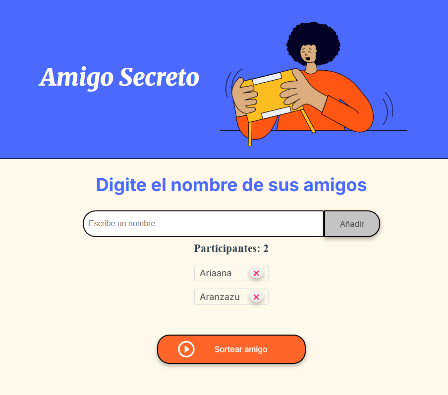
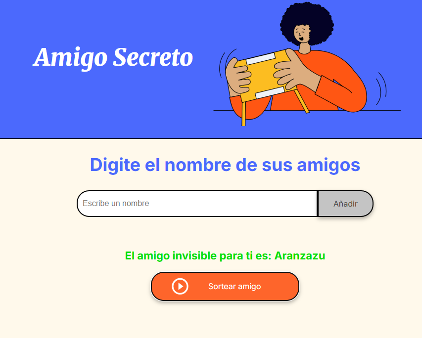

# 🎁 Amigo Invisible

Este es un pequeño proyecto web para realizar un **sorteo de Amigo Invisible** de manera sencilla. Los participantes ingresan sus nombres y luego se genera aleatoriamente un nombre seleccionado.

## 🛠️ Tecnologías utilizadas
- **HTML** para la estructura del contenido.
- **CSS** para los estilos y la apariencia visual.
- **JavaScript** para la lógica del sorteo y la interacción con el usuario.

## 🎯 Funcionalidades
✅ Agregar nombres a la lista de participantes.  
✅ Validación para evitar nombres duplicados.  
✅ Botón para realizar el sorteo.  
✅ Diseño responsivo y atractivo.

## 🚀 Cómo usar
1. **Abrir `index.html` en un navegador**.
2. **Ingresar nombres** en el campo de texto y hacer clic en **"Añadir"**.
3. **Hacer clic en "Sortear amigo"** para obtener un nombre aleatorio.
4. **Disfrutar del resultado del sorteo**. 🎉

## 🖼️ Captura de pantalla

## 📜 Licencia
Este proyecto es de uso libre. Puedes modificarlo y adaptarlo según tus necesidades.

---

¡Disfruta organizando tu sorteo de Amigo Invisible! 🥳
